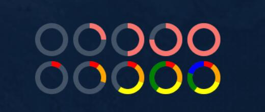

# CanvasRing

### 介绍

基于canvas的vue3圆环组件。来自->[老板不让用ECharts，还想让我画很多圆环！](https://juejin.cn/post/7444014749321510963)



## 代码演示

### 基础用法

```html
<div style="display: flex;justify-content: center;">
  <CanvasRing :stork-width="8" :size="60" :ratio-list="[{ ratio: 0, color: '#F8766F' }]" />
  <CanvasRing :stork-width="8" :size="60" :ratio-list="[{ ratio: 0.25, color: '#F8766F' }]" />
  <CanvasRing :stork-width="8" :size="60" :ratio-list="[{ ratio: 0.5, color: '#F8766F' }]" />
  <CanvasRing :stork-width="8" :size="60" :ratio-list="[{ ratio: 0.75, color: '#F8766F' }]" />
  <CanvasRing :stork-width="8" :size="60" :ratio-list="[{ ratio: 1, color: '#F8766F' }]" />
</div>
<div style="display: flex;justify-content: center;">
  <CanvasRing
    :stork-width="8"
    :size="60"
    :ratio-list="[
      { ratio: 0.1, color: 'red' },
    ]"
  />
  <CanvasRing
    :stork-width="8"
    :size="60"
    :ratio-list="[
      { ratio: 0.1, color: 'red' },
      { ratio: 0.2, color: 'orange' },
    ]"
  />
  <CanvasRing
    :stork-width="8"
    :size="60"
    :ratio-list="[
      { ratio: 0.1, color: 'red' },
      { ratio: 0.2, color: 'orange' },
      { ratio: 0.3, color: 'yellow' },
    ]"
  />
  <CanvasRing
    :stork-width="8"
    :size="60"
    :ratio-list="[
      { ratio: 0.1, color: 'red' },
      { ratio: 0.2, color: 'orange' },
      { ratio: 0.3, color: 'yellow' },
      { ratio: 0.4, color: 'green' },
    ]"
  />
  <CanvasRing
    :stork-width="8"
    :size="60"
    :ratio-list="[
      { ratio: 0.1, color: 'red' },
      { ratio: 0.2, color: 'orange' },
      { ratio: 0.3, color: 'yellow' },
      { ratio: 0.2, color: 'green' },
      { ratio: 0.2, color: 'blue' },
    ]"
  />
</div>
```

## API

### Props

| 参数 | 说明 | 类型 | 默认值 |
| ---- | ---- | ---- | ---- |
| size | 圆环尺寸 | _number_ | `100` |
| stork-width | 环的宽度 | _number_ | `4` |
| ratio-list | 比例列表 | _RatioItem[]_ | `[]` |

### RatioItem数据结构

| 键名 | 说明 | 类型 |
| ---- | ---- | ---- |
| ratio | 占比值(最小`0`，最大`1`) | _number_ |
| color | 颜色值(合法颜色值) | _string_ |
