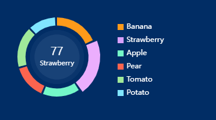

# RingPieChart

### 介绍

基于echarts的环形饼图组件，标签展示在圆心，支持自动切换扇区。



## 代码演示

### 基础用法

```html
<template>
  <div class="chart-box">
    <RingPieChart :data="testData" :size="150" :auto-play="true" />
  </div>
</template>

<script setup>
import RingPieChart from './RingPieChart.vue'
const testData = [
  {name: 'Banana', value: 66},
  {name: 'Strawberry', value: 77},
  {name: 'Apple', value: 55},
  {name: 'Pear', value: 50},
  {name: 'Tomato', value: 60},
  {name: 'Potato', value: 40},
]
</script>

<style lang="scss">
.chart-box {
  width: 360px;
  height: 200px;
  padding: 20px;
  box-sizing: border-box;
  background-color: #012d65;
}
</style>
```

### 自定义扇区颜色

注意：`colors`的个数不能小于`data`的个数。

```html
<RingPieChart :data="testData" :colors="['#003399', '#ff0000', 'ffff00']" />
```

同时也支持RGB/渐变/纹理填充等，详见[echarts配置项 > color](https://echarts.apache.org/zh/option.html#color)

## API

### Props

| 参数 | 说明 | 类型 | 默认值 |
| ---- | ---- | ---- | ---- |
| data | 数据源 | _DataItem[]_ | `[]` |
| colors | 调色盘颜色列表 | _color[]_ | `["#FF9B1A", "#D8A0FE", "#75F8C9", "#FD644F", "#A0E99A", "#80E6FF"]` |
| size | 圆环尺寸 | _number_ | `120` |
| autoPlay | 开启自动切换 | _boolean_ | `false` |
| interval | 自动切换间隙时间(毫秒) | _number_ | `1500` |

### DataItem数据结构

| 键名 | 说明 | 类型 |
| ---- | ---- | ---- |
| name | 数据项名称 | _string_ |
| value | 数据值 | _number_ |

同时也支持官方规定的其它选项，详见[echarts配置项 > series-pie.data](https://echarts.apache.org/zh/option.html#series-pie.data)
